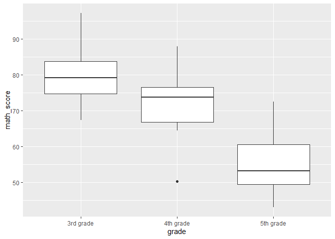

Conducting Analysis of Variance in R
================
Israel Arevalo
2023-01-31

- <a href="#loading-required-packages"
  id="toc-loading-required-packages">Loading required packages</a>
- <a href="#data-preparation" id="toc-data-preparation">Data
  Preparation</a>
- <a href="#setting-up-the-anova-model"
  id="toc-setting-up-the-anova-model">Setting up the ANOVA Model</a>
- <a href="#post-hoc-tests-and-interpretation"
  id="toc-post-hoc-tests-and-interpretation">Post-hoc Tests and
  Interpretation</a>
- <a href="#visualizing-the-results"
  id="toc-visualizing-the-results">Visualizing the Results</a>

An ANOVA (Analysis of Variance) is a statistical technique used to
determine whether there are significant differences between the means of
two or more groups. In R, the aov() function can be used to conduct an
ANOVA. In this guide, we will use educational data to demonstrate how to
conduct an ANOVA in R using R Markdown. This guide is designed as a
friendly approach to learn how to conduct statistical analysis within
the R environment.

As in previous guides, several assumptions about the user will be made.

1.  You have installed R and an IDE such as RStudio on your computer
2.  You have a dataset to work with (we will generate a dataset in this
    tutorial but you will need a dataset to run your own analysis
    outside of the tutorial, of course)

For additional information, please follow the links below as necessary.

- [Installing
  RStudio](https://rstudio-education.github.io/hopr/starting.html)
- [Exporting SPSS dataset to
  .CSV](https://www.ibm.com/docs/en/spss-statistics/beta?topic=files-exporting-datasets)
- [Exporting STATA dataset to
  .csv](https://stats.oarc.ucla.edu/stata/faq/how-do-i-export-stata-dta-files-to-comma-separated-files/)
- [Exporting Excel file to
  .csv](https://support.microsoft.com/en-us/office/import-or-export-text-txt-or-csv-files-5250ac4c-663c-47ce-937b-339e391393ba)

# Loading required packages

``` r
library(multcomp)
library(ggplot2)
```

# Data Preparation

First, we will need to load in the necessary packages and the data set.
For this tutorial, we will use a hypothetical data set that contains
information on students’ math scores and the grade level they are in (A,
B, or C).

``` r
set.seed(123)

data <- data.frame(student_id = 1:30,
                   grade = c(rep("3rd grade", 10), rep("4th grade", 10), rep("5th grade", 10)),
                   math_score = c(rnorm(10, mean = 80, sd = 10),
                                  rnorm(10, mean = 70, sd = 10),
                                  rnorm(10, mean = 60, sd = 10)))
```

Next, we will take a look at the structure of the data set using the
`str()` function.

``` r
str(data)
```

    ## 'data.frame':    30 obs. of  3 variables:
    ##  $ student_id: int  1 2 3 4 5 6 7 8 9 10 ...
    ##  $ grade     : chr  "3rd grade" "3rd grade" "3rd grade" "3rd grade" ...
    ##  $ math_score: num  74.4 77.7 95.6 80.7 81.3 ...

ADD INFORMATION HERE

# Setting up the ANOVA Model

Now that we have the data loaded, we can set up the ANOVA model. In this
example, we will use `math_score` as the dependent variable and `grade`
as the independent variable.

``` r
data$grade <- as.factor(data$grade)

model <- aov(math_score ~ grade, data = data)
```

We can then use the summary() function to view the results of the ANOVA.

``` r
summary(model)
```

    ##             Df Sum Sq Mean Sq F value   Pr(>F)    
    ## grade        2   3221  1610.5   16.93 1.72e-05 ***
    ## Residuals   27   2568    95.1                     
    ## ---
    ## Signif. codes:  0 '***' 0.001 '**' 0.01 '*' 0.05 '.' 0.1 ' ' 1

The output will show the F-value and the p-value for the ANOVA. A low
p-value (typically less than 0.05) indicates that there is a significant
difference in the means of the groups.

# Post-hoc Tests and Interpretation

After conducting the ANOVA, we can conduct post-hoc tests to determine
which specific groups are significantly different from each other. One
commonly used post-hoc test is the Tukey Honest Significant Differences
(HSD) test.

``` r
tukey <- glht(model, linfct = mcp(grade = "Tukey"))
summary(tukey)
```

    ## 
    ##   Simultaneous Tests for General Linear Hypotheses
    ## 
    ## Multiple Comparisons of Means: Tukey Contrasts
    ## 
    ## 
    ## Fit: aov(formula = math_score ~ grade, data = data)
    ## 
    ## Linear Hypotheses:
    ##                            Estimate Std. Error t value Pr(>|t|)    
    ## 4th grade - 3rd grade == 0   -8.660      4.362  -1.985  0.13517    
    ## 5th grade - 3rd grade == 0  -24.992      4.362  -5.730  < 0.001 ***
    ## 5th grade - 4th grade == 0  -16.332      4.362  -3.744  0.00244 ** 
    ## ---
    ## Signif. codes:  0 '***' 0.001 '**' 0.01 '*' 0.05 '.' 0.1 ' ' 1
    ## (Adjusted p values reported -- single-step method)

The output will show the p-values and group comparisons for the Tukey
HSD test.

The table shows the estimated difference in means between each pair of
groups, and the corresponding standard error, t-value, and p-value. The
p-values are used to determine whether the differences between the means
are statistically significant. A p-value of less than 0.05 (indicated by
\*\*) means that the difference is statistically significant, while a
p-value of greater than 0.05 (indicated by . or no symbol) means that
the difference is not statistically significant.

For example, the first row shows the comparison between the mean of the
4th grade and the mean of the 3rd grade. The estimated difference in
means is `-8.660`, with a p-value of `0.13517`, which is greater than
0.05. This means that there is not a statistically significant
difference between the mean math score of 4th grade and the mean math
score of 3rd grade.

On the other hand, the third row shows the comparison between the mean
of the 5th grade and the mean of the 4th grade. The estimated difference
in means is `-16.332`, with a p-value of `0.00244`, which is less than
0.05. This means that there is a statistically significant difference
between the mean math score of 5th grade and the mean math score of 4th
grade, and the 5th graders have a lower math score than the 4th graders.

This output shows the results of a statistical test that compares the
mean math score of different grade levels (3rd, 4th and 5th), and gives
an indication of whether the difference in mean math scores between any
two grade levels is statistically significant or not.

# Visualizing the Results

Finally, we can also create a plot to visualize the results of the
ANOVA. In this example, we will use the `ggplot2` package to create a
boxplot of the `math_score` variable for each level of the `grade`
variable.

``` r
ggplot(data, aes(x = grade, y = math_score)) + 
  geom_boxplot()
```

<!-- -->

This plot shows the distribution of the `math_score` variable for each
level of the `grade` variable, and can help to further illustrate the
differences between the groups.

In summary, ANOVA is a powerful statistical technique that can be used
to determine whether there are significant differences between the means
of two or more groups. In R, the `aov()` function can be used to conduct
an ANOVA, and post-hoc tests such as the Tukey HSD testcan provide
additional insights into specific group differences. Additionally,
visualizing the results using the `ggplot2` package can help to further
understand the differences between the groups.

It’s important to keep in mind that ANOVA assumes normality and equal
variances in the groups, so it’s a good practice to check these
assumptions before running ANOVA. If the assumptions of ANOVA are not
met, non-parametric alternatives such as the Kruskal-Wallis test can be
used.

In conclusion, this tutorial demonstrated how to conduct an ANOVA using
a hypothetical educational data set in R. The steps outlined in this
tutorial can be applied to any data set and any set of variables as long
as they meet the assumptions of ANOVA. By using ANOVA, we can test
whether there are significant differences in the means of groups, and
make inferences about the population based on our sample. Additionally,
post-hoc tests and visualization can provide additional insights into
specific group differences.
