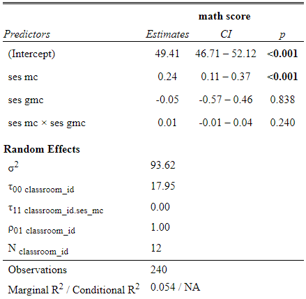

## Before we start

You can find this guide and more on my [github page](https://github.com/israelarevalo/R-simple-statistics-tutorials).

This guide was designed as a friendly approach to learn how to conduct statistical analysis within the R environment. R is a powerful open-source tool that allows for great flexibility and customization of when conducting data wrangling (cleaning), analysis, interpretation, and reporting. Did I mention its open-source? This not only means that it is free, but the entire code used to develop this exceptional language is entirely available for you to view (and even suggest changes) online.

Several assumptions about the user will be made within this guide. 

1. You have installed R and an IDE such as RStudio or Visual Studio Code on your computer
2. You have a dataset to work with


If these assumptions are not met, here are a few guides to reference that will get you up to speed 

* [Installing RStudio](https://rstudio-education.github.io/hopr/starting.html)
* [Exporting SPSS dataset to .CSV](https://www.ibm.com/docs/en/spss-statistics/beta?topic=files-exporting-datasets)
* [Exporting STATA dataset to .csv](https://stats.oarc.ucla.edu/stata/faq/how-do-i-export-stata-dta-files-to-comma-separated-files/)
* [Exporting Excel file to .csv](https://support.microsoft.com/en-us/office/import-or-export-text-txt-or-csv-files-5250ac4c-663c-47ce-937b-339e391393ba)

## Mixed Effects Models - What are they and how can we use them?

In educational research, it is common to collect data from multiple participants or classrooms. These data often exhibit nested or hierarchical structures, where individuals are nested within higher-level units (e.g., students within classrooms, classrooms within schools). In such cases, traditional statistical models assume independence of observations, which may lead to biased estimates of the parameters.

Mixed effects models, also known as hierarchical linear models (HLM), are statistical models that take into account the nested structure of the data and allow for the estimation of both fixed and random effects. Fixed effects are the parameters of interest that are assumed to be constant across all the individuals or units, while random effects capture the variability across individuals or units.

Using mixed effects models can improve the accuracy of the estimates, increase statistical power, and provide a more comprehensive understanding of the underlying processes in educational research. In this tutorial, we will use the R programming language to illustrate the basics of mixed effects modeling. We will use the `lme4` package, which is one of the most popular packages for fitting mixed effects models in R. 

## Generating our Dataset

Using randomly-generated data, let's build a fictitious dataset to math the scenario above and that we will use to run our HLM Model. 

> ***Note***
> 
> This step is only required for the instructional nature of this tutorial. 
> You will **not** need to run this step as you do not need to randomly 
> generate your data. Unless you do... in which case, have at it!


In the code block below, we will generate a dataframe consisting of math scores from students nested within classrooms and their respective SES. The purpose of this example is to determine whether SES had an effect on math scores while taking into account the nested structure of the data.

```{r message=FALSE, warning=FALSE}

# Generate sample data
set.seed(1342)
n_classrooms <- 12
n_students <- 10
classroom_means_math <- rnorm(n_classrooms, mean = 50, sd = 5) # random means for each classroom in math scores
classroom_means_ses <- rnorm(n_classrooms, mean = 50, sd = 10) # random means for each classroom in SES
math_score_ctrl <- rnorm(n_classrooms*n_students, mean = rep(classroom_means_math, each = n_students), sd = 10)
math_score_trt <- rnorm(n_classrooms*n_students, mean = rep(classroom_means_math, each = n_students) + 3, sd = 7) # higher mean and smaller SD
math_score <- c(math_score_ctrl, math_score_trt)
ses_ctrl <- rnorm(n_classrooms*n_students, mean = rep(classroom_means_ses, each = n_students), sd = 10)
ses_trt <- rnorm(n_classrooms*n_students, mean = rep(classroom_means_ses, each = n_students) + 5, sd = 5) # higher mean and smaller SD
ses <- c(ses_ctrl, ses_trt)
classroom_id <- rep(1:n_classrooms, each = n_students*2)
student_id <- rep(1:(n_students*2), times = n_classrooms)

# Create data frame
data <- data.frame(math_score, classroom_id, student_id, ses)

# Show first few rows
head(data)
```

## Exploring our Data

Let's take a look at simple descriptive statisitcs within our data. Running the base (summary) command allows us to look at information such as the minimum, maximum, quartiles, median, and means for each variable within our dataset. You can further customize this command by adding further adjustments to the command itself. For example, if we want to run5 a summary command on just 1 or 2 variables within a dataset containing many other variables, we can adjust our code to specify which variables we are interested in by adding a `$` symbol after the name of the dataset and then specifying the name of the variable  (i.e., `summary(df$ses`). Below we have run a simple `summary` command to explore our generated dataset. Since we only generated two variables, we do not need to specify which variables we are interested in. 

```{r message=FALSE, warning=FALSE}

summary(data)
```

Some summary information may not be necessarily useful (e.g., classroom_id and student_id). When analyzing nested data, we can leverage the `dplyr` package to group students by classroom and then calculate descriptive data. The `dplyr` package is a powerful tool that allows us to conduct data wrangling (cleaning) and analysis. In the code block below, we will use the `dplyr` package to group our students by classroom and then calculate the number of students per classroom and the mean and standard deviation of their math scores. Additionally, we will use the `describeBy` function from the `psych` package to calculate descriptive statistics for each classroom.

```{r message=FALSE, warning=FALSE}

# Load dplyr and psych package
library(dplyr)
library(psych)

# Group students by classroom and calculate the number of students per classroom
data %>% 
  group_by(classroom_id) %>% 
  summarise(n = n()) %>%
  ungroup()

# Group students by classroom and calculate mean and standard deviation
data %>%
  group_by(classroom_id) %>%
  summarise(mean = mean(math_score), sd = sd(math_score)) %>%
  ungroup()

data %>%
  describeBy(group = "classroom_id")
```

Great! It looks like we have 10 students per classroom and their mean math scores range between 45 and 55. Also, thanks to the `psych` package, we get detailed group-level descriptive statistics for each classroom.

Let's visualize this information using a histogram. To do this, we can use the `ggplot2` package. This package allows us to create beautiful and informative data visualizations. In the code block below, we will use the `ggplot2` package to create a histogram of our math scores. Also, let's bring in the `facet_wrap` function to create a histogram for each classroom.

```{r message=FALSE, warning=FALSE}

# Load ggplot2 package
library(ggplot2)

# Plot histogram
ggplot(data, aes(x = math_score)) +
  geom_histogram(binwidth = 5) +
  facet_wrap(~classroom_id)
```

This histogram shows us the distribution of math scores across all classrooms. For the most part, all classroom scores appear to be normally distributed.

## Centering our Data

According to best practices, we want to mean and grand mean center our data before running our mixed effects model. This is because centering our data allows us to interpret the intercept as the mean of the outcome variable when all predictors are at their mean. In the code block below, we will use the `MLMusingR` and `misty` package to mean and grand mean center our data. 

```{r message=FALSE, warning=FALSE}

library(MLMusingR) #using for centering
library(misty) #used for grand mean centering

# Creating Group Means for SES
data <- data %>%
  group_by(classroom_id) %>%
  mutate(ses_grpmean = mean(ses)) %>%
  ungroup()

# Group mean centering SES
data <- data %>%
  mutate(ses_mc = group_center(ses, classroom_id))

data$ses_mc <- as.numeric(data$ses_mc)

# Grand mean centering Gender
data <- data %>%
  mutate(ses_gmc = center(ses_grpmean, type = "CGM", cluster = classroom_id))
```

When mean centering our data within the context of HLM, our mean centered variable is the difference between the individual score and the group mean. For example, if a student's SES score is 60 and the mean SES score for their classroom is 50, then the mean centered SES score for that student is 10. 

When grand mean centering our data within the context of HLM, our grand mean centered variable is the difference between the group mean and the grand mean. For example, if the mean SES score for a classroom is 50 and the grand mean SES score for the entire sample is 45, then the grand mean centered SES score for that classroom is 5.

Here's how your dataframe should look like up to this point:

```{r message=FALSE, warning=FALSE}

head(data)
```

## Running our Model

Now that we have explored our data and centered our variables, we are ready to run our HLM model. In the code block below, we will use the `lme4` package to run our models. The `lme4` package is a powerful tool that allows us to run mixed effects models and has a similar syntax to the `lm` function. The `lmerTest` package is an extension of the `lme4` package and allows us to run significance tests for our models.

### Null Model
```{r message=FALSE, warning=FALSE}

# Load lme4 package
library(lme4)
library(lmerTest)

# Run null model
null_model <- lmer(math_score ~ 1 + (1 | classroom_id), data = data)
summary(null_model)
```

In this model, we are predicting math scores using a random intercept for classroom. The random intercept for classroom is represented by `(1 | classroom_id)`. The `1` represents the intercept and the `classroom_id` represents the groups.

### Full Model

Now, let's run our full model. We want to see if SES has an effect on student math scores. We are also adding an interaction effect between student level SES and classroom level SES to investigate how the classroom makeup may impact student performance.

```{r message=FALSE, warning=FALSE}

# Run full model
full_model <- lmer(math_score ~  ses_mc + ses_gmc + ses_mc:ses_gmc + (1 + ses_mc | classroom_id), data = data)
summary(full_model)
```

In this model, we are predicting math scores using ses_mc, ses_gmc, and the interaction between these two variables. We are also allowing the intercept and ses_mc to vary across classrooms. The random intercept and ses_mc for classroom is represented by `(1 + ses_mc | classroom_id)`. 

The summary output provides the estimates for the fixed and random effects produced by the model. Each of these estimates can be further interpreted. Additionally, a correlation matrix of the fixed effects is produced. There are packages that can be used to create publication-ready tables and offer high flexibility (e.g., `sjPlot`). An example of an unedited table produced by `sjPlot` is included below.

<!-- -->


## Summary

In conclusion, this tutorial provides an introduction to mixed effects models (HLM) and explains how they can be used to analyze educational research data that exhibit a nested or hierarchical structure. By taking into account the nested structure of the data and allowing for the estimation of both fixed and random effects, mixed effects models can improve the accuracy of the estimates, increase statistical power, and provide a more comprehensive understanding of the underlying processes. The tutorial uses the R programming language and the `lme4` package to illustrate the basics of mixed effects modeling. It also provides step-by-step instructions exploring the data using descriptive statistics. Future tutorials include the use of mixed effects/HLM approaches using longitiduinal data. 
